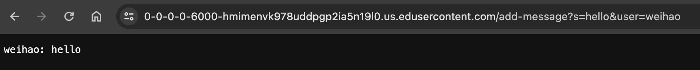
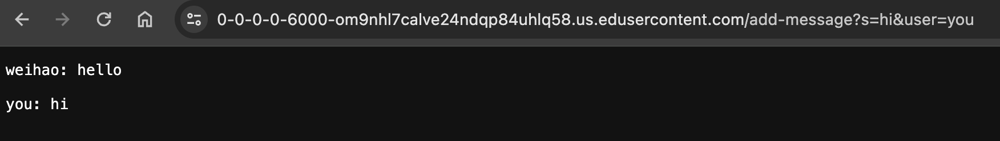
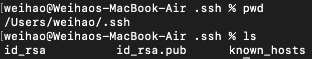
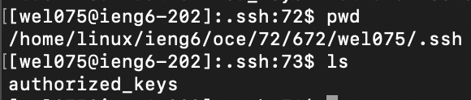
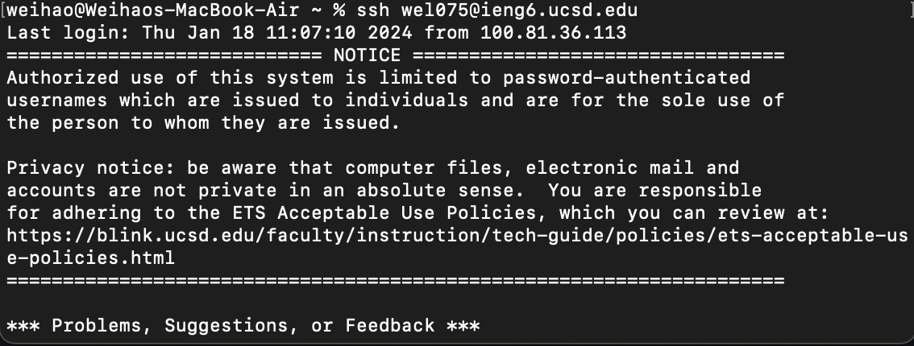

# Part 1: `ChatServer.java` code

```
import java.io.IOException;
import java.net.URI;
import java.util.ArrayList;

class Handler implements URLHandler {
    // The one bit of state on the server: a number that will be manipulated by
    // various requests.
    ArrayList<String> messages = new ArrayList<>();
    String list;

    public String handleRequest(URI url) {
        if (url.getPath().equals("/")) {
            list = String.join("\n", messages);
            return String.format("%s", list);
        } 
        else if (url.getPath().equals("/add-message")) {
            String[] parameters = url.getQuery().split("&");
            String[] messageParam = parameters[0].split("=");
            try {
                String[] userParam = parameters[1].split("=");
                if (messageParam[0].equals("s") && userParam[0].equals("user")) {
                    messages.add(userParam[1] + ": " + messageParam[1] + "\n");
                    list = String.join("\n", messages);
                    return String.format("%s", list);
                } 
            }
            catch (ArrayIndexOutOfBoundsException e) {
                return String.format("Invalid input!");
            }
        }
        return "404 Not Found!";
    }
}

class ChatServer {
    public static void main(String[] args) throws IOException {
        if(args.length == 0){
            System.out.println("Missing port number! Try any number between 1024 to 49151");
            return;
        }

        int port = Integer.parseInt(args[0]);

        Server.start(port, new Handler());
    }
}
```
First `/add-message` example:



This calls the `getPath()` method first to compare the url path to specifically "/add-message".
Then, `getQuery()` and `split()` are called to retrieve the information after "/add-message" and split the message from the user, storing both in `String[] parameters`.
In this case, `parameters[0]` would be `s=hello` and `parameters[1]` would be `user=weihao`.
A try-catch block finds invalid inputs in the query by checking if the following methods access an out of bounds index from the aforementioned string array.
If the input is valid, more `split()` methods are called in order to separate out the keys from the message and the user. 
These values are stored in `String[] messageParam` and `String[] userParam`, respectively. 
`messageParam` would contain `s` and `hello` while `userParam` would contain `user` and `weihao`.
Then, the formatted message is appended to the arraylist `messages` with `add()`, and each element in `messages` is combined into a single string `list` with a new line character
using `join()` in order to display everything cleanly on the server.




This calls the `getPath()` method first to compare the url path to specifically "/add-message".
Then, `getQuery()` and `split()` are called to retrieve the information after "/add-message" and split the message from the user, storing both in `String[] parameters`.
In this case, `parameters[0]` would be `s=hi` and `parameters[1]` would be `user=you`.
A try-catch block finds invalid inputs in the query by checking if the following methods access an out of bounds index from the aforementioned string array.
If the input is valid, more `split()` methods are called in order to separate out the keys from the message and the user. 
These values are stored in `String[] messageParam` and `String[] userParam`, respectively.
`messageParam` would contain `s` and `hi` while `userParam` would contain `user` and `you`.
Then, the formatted message is appended to the arraylist `messages` with `add()`, and each element in `messages` is combined into a single string `list` with a new line character
using `join()` in order to display everything cleanly on the server. Since `messages` now has two elements, they are joined together into a single string with `\n` between them.
`list` would be `"weihao: hello \n you: hi"`.

# Part 2: SSH

Private key:


Public key:


SSH:


# Part 3

I learned that you can ssh into ieng6 without your password with your computer's keys. I didn't know you could use scp to securely copy the key over to the remote account.
This would have saved so much time in a previous class where I had to ssh into ieng6 every time I wanted to work on my PAs.

